# KIẾN TRÚC CƠ SỞ DỮ LIỆU & SƠ ĐỒ THỰC THỂ LIÊN KẾT (ERD)
## Hệ Thống Quản Lý Nghiên Cứu Khoa Học & Thẩm Định Y Sinh (HIS-CRMS)
> **Tiêu chuẩn áp dụng:** Thông tư 09/2024/TT-BYT & Thông tư 43/2024/TT-BYT của Bộ Y tế.

---

## 1. Sơ Đồ Thực Thể Liên Kết Toàn Diện (Mermaid ERD)

```mermaid
erDiagram
    DEPARTMENTS ||--o{ USERS : "thuộc"
    DEPARTMENTS ||--o{ PROJECTS : "đơn vị chủ trì"
    
    USERS ||--o{ PROJECTS : "chủ nhiệm (PI)"
    USERS ||--o{ PROJECT_MEMBERS : "thành viên tham gia"
    USERS ||--o{ COUNCIL_MEMBERS : "bổ nhiệm vào HĐ"
    USERS ||--o{ COUNCIL_REVIEWS : "thành viên chấm điểm"
    USERS ||--o{ AUDIT_LOGS : "thực hiện tác vụ"
    USERS ||--o{ NOTIFICATIONS : "nhận thông báo"
    
    REGISTRATION_ROUNDS ||--o{ PROJECTS : "tiếp nhận"
    REGISTRATION_ROUNDS ||--o{ COUNCILS : "thành lập cho đợt"
    
    PROJECTS ||--o{ PROJECT_MEMBERS : "nhóm nghiên cứu"
    PROJECTS ||--o{ PROJECT_MILESTONES : "chia giai đoạn"
    PROJECTS ||--o{ PROJECT_BUDGET_ITEMS : "dự toán kinh phí"
    PROJECTS ||--o{ ETHICS_APPROVALS : "thẩm định IRB"
    PROJECTS ||--o{ COUNCIL_REVIEWS : "phiếu đánh giá"
    PROJECTS ||--o{ COUNCIL_MINUTES : "biên bản họp HĐ"
    PROJECTS ||--o{ PROGRESS_REPORTS : "báo cáo định kỳ"
    PROJECTS ||--o{ CHANGE_REQUESTS : "yêu cầu điều chỉnh"
    PROJECTS ||--o{ PROJECT_DOCUMENTS : "quản lý tệp/phiên bản"
    PROJECTS ||--o{ FINANCIAL_VOUCHERS : "chứng từ quyết toán"
    PROJECTS ||--o{ PROJECT_PUBLICATIONS : "bài báo công bố"
    PROJECTS ||--o{ CLINICAL_APPLICATIONS : "chuyển giao lâm sàng"
    
    COUNCILS ||--o{ COUNCIL_MEMBERS : "danh sách ủy viên"
    COUNCILS ||--o{ COUNCIL_REVIEWS : "thuộc phiên họp"
    COUNCILS ||--o{ COUNCIL_MINUTES : "kết luận phiên họp"
    COUNCILS ||--o{ ETHICS_APPROVALS : "HĐ Đạo đức chủ trì"

    USERS {
        uuid id PK
        string full_name "Họ và tên cán bộ"
        string email "Email công vụ / cá nhân"
        string phone "Số điện thoại liên lạc"
        string academic_title "GS, PGS, TS, BSCKII, ThS, BS..."
        string role "RESEARCHER, OFFICE, COUNCIL, DIRECTOR, ADMIN"
        uuid department_id FK
        boolean is_active "Trạng thái tài khoản"
    }

    DEPARTMENTS {
        uuid id PK
        string department_code "Mã khoa/phòng (KTM, KKB, PKHTH...)"
        string name "Tên Khoa/Phòng/Trung tâm"
        string department_type "CLINICAL, PARACLINICAL, ADMINISTRATIVE"
        uuid manager_id FK "Trưởng khoa / Trưởng phòng"
    }

    REGISTRATION_ROUNDS {
        uuid id PK
        string round_code "DOT-2026-01"
        string name "Tên đợt đăng ký nghiên cứu"
        int year "Năm kế hoạch"
        date start_date "Ngày mở tiếp nhận"
        date end_date "Hạn chót nộp hồ sơ"
        decimal max_budget_per_project "Hạn mức tối đa/đề tài"
        string status "UPCOMING, OPEN, CLOSED, EVALUATING, CONCLUDED"
    }

    PROJECTS {
        uuid id PK
        string project_code "Mã đề tài chính thức (DT-2026-xxx)"
        string proposal_code "Mã hồ sơ đề xuất (DX-2026-xxx)"
        string title "Tên đề tài nghiên cứu"
        text summary "Tóm tắt mục tiêu & phương pháp"
        string research_field "Lĩnh vực (Nội, Ngoại, Sản, Nhi, Dược...)"
        string management_level "CƠ_SỞ, BỘ, TỈNH, QUỐC_GIA"
        string project_type "LÂM_SÀNG, DỊCH_TỄ, CAN_THIỆP, CẢI_TIẾN"
        uuid principal_investigator_id FK "Chủ nhiệm đề tài (PI)"
        uuid department_id FK "Khoa/Phòng chủ trì"
        uuid registration_round_id FK "Đợt đăng ký áp dụng"
        date start_date "Ngày bắt đầu"
        date end_date "Ngày nghiệm thu dự kiến"
        decimal estimated_budget "Kinh phí đề xuất (VND)"
        decimal approved_budget "Kinh phí được phê duyệt (VND)"
        string funding_source "NGÂN_SÁCH_BV, TỰ_TÚC, TÀI_TRỢ, HỖN_HỢP"
        int progress_percentage "Tiến độ thực hiện 0-100%"
        string proposal_status "DRAFT, SUBMITTED, REVIEWING, APPROVED, REJECTED"
        string status "NOT_STARTED, IN_PROGRESS, EXTENDED, COMPLETED, CANCELLED"
        boolean ethics_required "Có thuộc diện thẩm định IRB không"
        string ethics_status "NOT_REQUIRED, SUBMITTED, APPROVED, CONDITIONAL"
        timestamp created_at
    }

    PROJECT_MEMBERS {
        uuid id PK
        uuid project_id FK
        uuid user_id FK
        string role_in_project "CHỦ_NHIỆM, THƯ_KÝ_KH, THÀNH_VIÊN_CHÍNH, CỘNG_TÁC_VIÊN"
        int contribution_percentage "Tỷ lệ đóng góp %"
    }

    PROJECT_MILESTONES {
        uuid id PK
        uuid project_id FK
        string milestone_name "Tên mốc tiến độ (Thu thập 100 mẫu, Xử lý SPSS...)"
        int sequence_order "Thứ tự mốc 1, 2, 3..."
        date expected_deadline "Hạn hoàn thành"
        date actual_completion_date "Ngày hoàn thành thực tế"
        string status "PENDING, IN_PROGRESS, COMPLETED, DELAYED"
    }

    PROJECT_BUDGET_ITEMS {
        uuid id PK
        uuid project_id FK
        string expense_category "CÔNG_LAO_ĐỘNG, VẬT_TƯ_TIÊU_HAO, BỆNH_PHẨM, HỘI_THẢO"
        string item_name "Tên khoản chi tiết"
        decimal unit_price "Đơn giá"
        int quantity "Số lượng"
        decimal total_amount "Thành tiền"
    }

    COUNCILS {
        uuid id PK
        string council_code "Mã HĐ (HĐ-2026-xxx)"
        string name "Tên Hội đồng Khoa học / HĐ Đạo đức"
        string council_type "PROPOSAL_REVIEW, ACCEPTANCE, ETHICS_IRB"
        string decision_number "Số QĐ thành lập do Giám đốc BV ký"
        date establishment_date "Ngày ra quyết định"
        date meeting_date "Thời gian tổ chức phiên họp"
        string location "Địa điểm phòng họp / Trực tuyến"
        uuid round_id FK
        string status "ESTABLISHED, IN_PROGRESS, CONCLUDED"
    }

    COUNCIL_MEMBERS {
        uuid id PK
        uuid council_id FK
        uuid user_id FK
        string council_role "CHỦ_TỊCH, PHÓ_CHỦ_TỊCH, PHẢN_BIỆN_1, PHẢN_BIỆN_2, THƯ_KÝ, ỦY_VIÊN"
        boolean attendance_status "Có mặt / Vắng mặt"
    }

    COUNCIL_REVIEWS {
        uuid id PK
        uuid council_id FK
        uuid project_id FK
        uuid member_id FK
        decimal score_necessity "Tính cấp thiết & Mục tiêu (0-20)"
        decimal score_methodology "Phương pháp & Đạo đức y sinh (0-30)"
        decimal score_feasibility "Tính khả thi & Cơ sở vật chất (0-20)"
        decimal score_clinical_value "Khả năng ứng dụng lâm sàng (0-20)"
        decimal score_budget "Dự toán kinh phí hợp lý (0-10)"
        decimal total_score "Tổng điểm phiếu chấm / 100"
        string evaluation_result "ĐẠT, ĐẠT_CÓ_CHỈNH_SỬA, KHÔNG_ĐẠT"
        text comments "Nhận xét chi tiết của Ủy viên"
        timestamp reviewed_at
    }

    COUNCIL_MINUTES {
        uuid id PK
        uuid council_id FK
        uuid project_id FK
        string minute_code "BB-HĐ-2026-xxx"
        decimal average_score "Điểm trung bình toàn Hội đồng"
        string final_conclusion "THÔNG_QUA, CHỈNH_SỬA_BẢO_VỆ_LẠI, KHÔNG_THÔNG_QUA"
        text summary_comments "Tổng hợp kết luận của Chủ tịch Hội đồng"
        text required_revisions "Các điểm bắt buộc đề tài phải chỉnh sửa"
        decimal approved_budget "Kinh phí Hội đồng thông qua (VND)"
        string signed_file_url "File scan biên bản có chữ ký các thành viên"
        date finalized_date
    }

    ETHICS_APPROVALS {
        uuid id PK
        uuid project_id FK
        uuid council_id FK
        string irb_certificate_number "Số Giấy chứng nhận Chấp thuận Đạo đức Y sinh"
        string review_type "FULL_BOARD, EXPEDITED, EXEMPT"
        string approval_status "APPROVED, MINOR_REVISIONS, REJECTED"
        date issue_date "Ngày cấp chứng nhận"
        date valid_until "Ngày hết hạn hiệu lực"
        text ethical_conditions "Điều kiện ràng buộc đối với nghiên cứu"
    }

    CLINICAL_APPLICATIONS {
        uuid id PK
        uuid project_id FK
        string protocol_name "Tên Quy trình kỹ thuật / Phác đồ điều trị mới"
        uuid target_department_id FK "Khoa lâm sàng tiếp nhận chuyển giao"
        string handover_decision_number "Số QĐ ban hành phác đồ của Giám đốc BV"
        date handover_date "Ngày bàn giao chính thức"
        text effectiveness_evaluation "Đánh giá hiệu quả sau ứng dụng"
    }

    PROGRESS_REPORTS {
        uuid id PK
        uuid project_id FK
        string report_period "ĐỊNH_KỲ_6_THÁNG, ĐỊNH_KỲ_12_THÁNG, ĐỘT_XUẤT"
        int reported_progress_percentage "Tiến độ tự báo cáo %"
        text completed_tasks "Khối lượng công việc đã hoàn thành"
        text difficulties_encountered "Khó khăn, vướng mắc"
        text next_period_plan "Kế hoạch giai đoạn tiếp theo"
        string report_file_url "File đính kèm báo cáo"
        string verification_status "PENDING, ACCEPTED, REVISION_REQUIRED"
        date submitted_date
    }

    CHANGE_REQUESTS {
        uuid id PK
        uuid project_id FK
        uuid requester_id FK
        string request_type "EXTEND_DEADLINE, CHANGE_PI, ADJUST_BUDGET, MODIFY_METHOD"
        text reason "Lý do đề nghị điều chỉnh"
        text proposed_changes "Nội dung thay đổi chi tiết"
        string status "PENDING, APPROVED, REJECTED"
        uuid approved_by FK
        timestamp requested_date
    }

    PROJECT_DOCUMENTS {
        uuid id PK
        uuid project_id FK
        string document_type "PROPOSAL, OUTLINE, IRB_DOSSIER, PROGRESS_REPORT, ACCEPTANCE_SUMMARY"
        string file_name "Tên tệp tin"
        string file_url "Đường dẫn tải về"
        int version "Phiên bản tài liệu (1, 2...)"
        boolean is_current "Có phải bản mới nhất không"
        uuid uploaded_by FK
        timestamp uploaded_at
    }

    FINANCIAL_VOUCHERS {
        uuid id PK
        uuid project_id FK
        string voucher_code "Mã chứng từ / Phiếu chi / Hóa đơn"
        string expense_category "Vật tư tiêu hao, Xét nghiệm, Thù lao, Hội nghị..."
        decimal amount "Số tiền chi trả (VND)"
        date issue_date "Ngày lập chứng từ"
        string status "DRAFT, APPROVED, DISBURSED"
        string voucher_file_url "File scan hóa đơn / chứng từ thanh toán"
    }

    PROJECT_PUBLICATIONS {
        uuid id PK
        uuid project_id FK
        string publication_type "TẠP_CHÍ_QUỐC_TẾ, TẠP_CHÍ_TRONG_NƯỚC, KỶ_YẾU_HỘI_NGHỊ"
        string title "Tên bài báo công bố"
        string journal_name "Tên tạp chí y học"
        string ranking "ISI/Scopus Q1-Q4, Tạp chí tính điểm HĐGSNN"
        string doi_or_url "Chỉ số DOI hoặc link bài báo"
        date publication_date
    }

    AUDIT_LOGS {
        uuid id PK
        uuid user_id FK
        string action "CREATE, UPDATE, APPROVE, REJECT, EXPORT"
        string entity_name "PROJECT, COUNCIL, VOUCHER, ETHICS..."
        string entity_id
        json old_values "Dữ liệu trước thay đổi"
        json new_values "Dữ liệu sau thay đổi"
        timestamp created_at
    }

    NOTIFICATIONS {
        uuid id PK
        uuid recipient_id FK
        string title "Tiêu đề thông báo"
        string message "Nội dung thông báo"
        string action_url "Đường dẫn xử lý nhanh"
        boolean is_read "Trạng thái đã đọc"
        timestamp created_at
    }
```

---

## 2. Danh Mục Các Thực Thể & Vai Trò Trong Quy Trình

| Thực thể (Table) | Mô tả & Nghiệp vụ | Quy định / Thông tư liên quan |
| :--- | :--- | :--- |
| **`PROJECTS`** | Hồ sơ đề tài nghiên cứu từ giai đoạn Đề xuất $\rightarrow$ Thẩm định $\rightarrow$ Thực hiện $\rightarrow$ Nghiệm thu. | TT 09/2024/TT-BYT |
| **`COUNCILS`** | Các Hội đồng Khoa học & Công nghệ, Hội đồng Đạo đức Y sinh (IRB). | TT 09/2024 & TT 43/2024 |
| **`COUNCIL_REVIEWS`** | Phiếu chấm điểm điện tử theo 5 tiêu chí thành phần (BM-HĐ-01, BM-NT-01). | TT 09/2024/TT-BYT |
| **`COUNCIL_MINUTES`** | Biên bản họp Hội đồng và kết luận xếp loại đề tài (BM-HĐ-02, BM-NT-02). | TT 09/2024/TT-BYT |
| **`ETHICS_APPROVALS`** | Giấy chứng nhận Chấp thuận Đạo đức Y sinh học (BM-ĐĐ-01) của Hội đồng IRB. | TT 43/2024/TT-BYT |
| **`CLINICAL_APPLICATIONS`**| Biên bản bàn giao phác đồ, quy trình kỹ thuật mới cho các khoa điều trị (BM-CG-01).| Quy chế bệnh viện |
| **`PROJECT_MILESTONES`** | Phân kỳ giai đoạn nghiên cứu (Thu thập mẫu, phân tích số liệu, viết báo cáo). | Quản lý tiến độ |
| **`PROJECT_BUDGET_ITEMS`**| Danh mục dự toán kinh phí theo khoản mục chi chuẩn hóa. | TT 03/2023/TT-BTC |
| **`FINANCIAL_VOUCHERS`** | Quản lý hóa đơn, phiếu chi thanh quyết toán kinh phí đề tài. | Tài chính NCKH |
| **`PROJECT_PUBLICATIONS`**| Bài báo khoa học quốc tế (ISI/Scopus) và trong nước xuất bản từ đề tài. | Đầu ra KH&CN |
| **`AUDIT_LOGS`** | Nhật ký vết kiểm toán toàn bộ thao tác duyệt, chấm điểm, nộp hồ sơ. | An toàn dữ liệu y tế |
